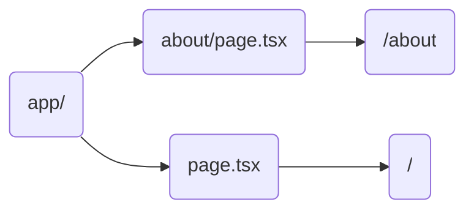
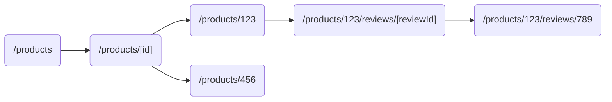
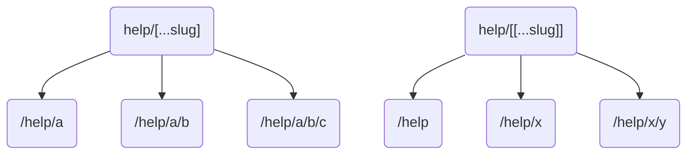
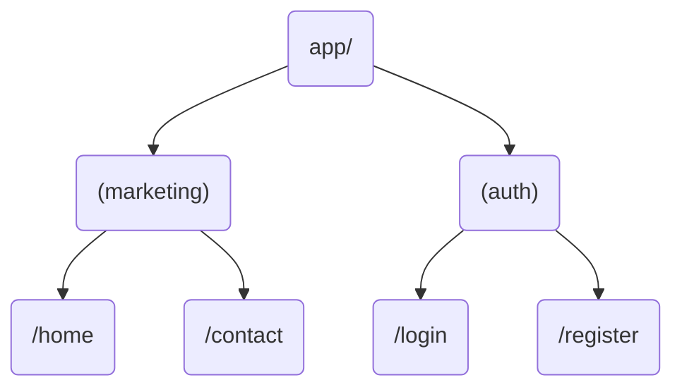
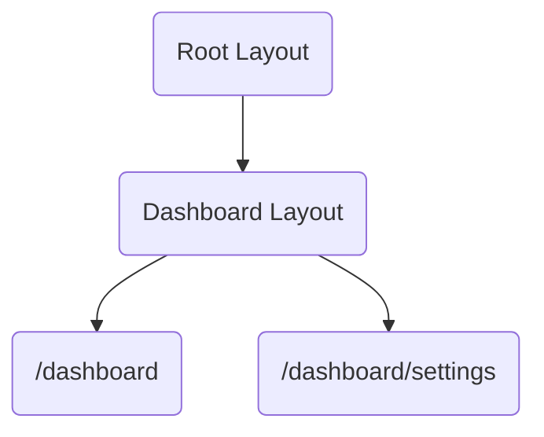
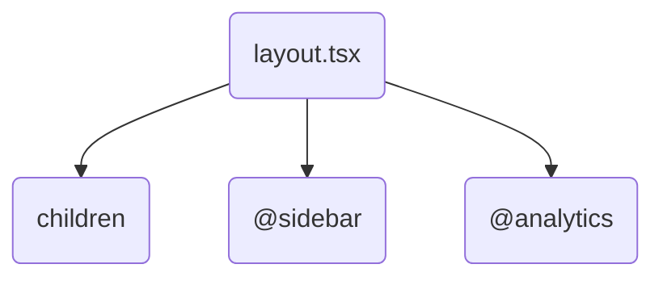
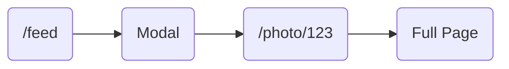
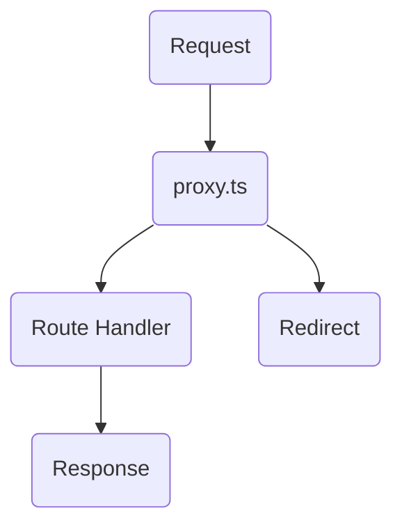
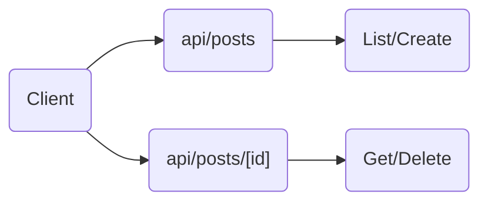

# Next.js Full Routing Showcase


This repository demonstrates all major routing patterns in modern Next.js (App Router) using **Next.js 16**.

---

## 📑 Table of Contents

- [Features](#-features)
- [Project Structure](#-project-structure)
- [Getting Started](#-getting-started)
- [Routing Patterns](#-routing-patterns)
- [Routing Flow Diagrams](#-routing-flow-diagrams)
- [Special Files](#-special-files)
- [Deployment](#-deployment)
- [Learn More](#-learn-more)
- [License](#-license)

---

## ✨ Features

- Static pages
- Dynamic pages
- Nested dynamic pages
- Catch-all & optional catch-all
- Route groups
- Layout & nested layouts
- Parallel routes
- Intercepting routes
- Proxy (formerly Middleware)
- API routes
- Special files: `loading.tsx`, `error.tsx`, `not-found.tsx`, `global-error.tsx`

---

## 📁 Project Structure Examples

<details>
<summary><strong>Static & Dynamic Routes</strong></summary>

```
app/
├─ page.tsx                                     → /
├─ about/page.tsx                               → /about
├─ products/page.tsx                            → /products
├─ products/[id]/page.tsx                       → /products/123
├─ products/[id]/reviews/[reviewId]/page.tsx    → /products/123/reviews/456
├─ blog/[slug]/page.tsx                         → /blog/my-post
```

</details>

<details>
<summary><strong>Catch-All Routes</strong></summary>

```
app/
├─ help/[...slug]/page.tsx                      → /help/a/b/c
├─ help/[[...slug]]/page.tsx                    → /help OR /help/a/b
```

</details>

<details>
<summary><strong>Route Groups</strong></summary>

```
app/
├─ (marketing)/home/page.tsx                    → /home
├─ (marketing)/contact/page.tsx                 → /contact
├─ (auth)/login/page.tsx                        → /login
├─ (auth)/register/page.tsx                     → /register
```

</details>

<details>
<summary><strong>Layouts & Parallel Routes</strong></summary>

```
app/
├─ dashboard/layout.tsx                         → layout for /dashboard/*
├─ dashboard/page.tsx                           → /dashboard
├─ dashboard/settings/page.tsx                  → /dashboard/settings
├─ dashboard/@sidebar/page.tsx                  → parallel sidebar
├─ dashboard/@sidebar/default.tsx               → parallel route fallback
├─ @analytics/page.tsx                          → parallel route
```

</details>

<details>
<summary><strong>Intercepting Routes</strong></summary>

```
app/
├─ feed/page.tsx                                → /feed
├─ feed/@modal/(..)photo/[id]/page.tsx          → modal (intercepting)
├─ photo/[id]/page.tsx                          → /photo/123 (full page)
```

</details>

<details>
<summary><strong>API Routes</strong></summary>

```
app/
├─ api/hello/route.ts                           → /api/hello
├─ api/posts/[id]/route.ts                      → /api/posts/:id
```

</details>

<details>
<summary><strong>Special Files</strong></summary>

```
app/
├─ layout.tsx                                   → root layout
├─ template.tsx                                 → re-mounts on navigation
├─ loading.tsx                                  → loading skeleton
├─ error.tsx                                    → error boundary
├─ not-found.tsx                                → custom 404
├─ forbidden.tsx                                → custom 403 (Next.js 16)
├─ unauthorized.tsx                             → custom 401 (Next.js 16)
├─ global-error.tsx                             → global error boundary
proxy.ts                                        → global proxy
```

</details>

---

## 🚀 Getting Started

```bash
npm install
npm run dev
```

Visit `http://localhost:3000`.

---

## 🛤️ Routing Patterns

### 1. Static Routes

`/about`, `/contact`, `/`

Simple, file-based routes. Create a folder with a `page.tsx` file and you have a route.

### 2. Dynamic Routes

`/products/[id]`, `/blog/[slug]`

Use square brackets to create dynamic segments that capture URL parameters.

### 3. Nested Dynamic

`/products/[id]/reviews/[reviewId]`

Combine multiple dynamic segments for deeply nested routes.

### 4. Catch-All & Optional Catch-All

- `/help/[...slug]` → matches `/help/a`, `/help/a/b`, `/help/a/b/c`
- `/help/[[...slug]]` → also matches `/help` (optional)

### 5. Route Groups

`(marketing)` and `(auth)` → group folders for organizational purposes, do not appear in URL.

### 6. Layouts

Layouts wrap a subtree and preserve state across navigation. Example: `dashboard/layout.tsx`

### 7. Parallel Routes

`@analytics` or `@sidebar` → render multiple UI slots simultaneously in the same layout.

### 8. Intercepting Routes

`(..)` syntax overlays one route inside another, perfect for modal windows that preserve context.

### 9. Proxy (Next.js 16)

`proxy.ts` → intercept requests for auth checks, redirects, headers. Replaces `middleware.ts` from earlier versions.

### 10. API Routes

`app/api/*/route.ts` → handle RESTful endpoints with GET, POST, PUT, DELETE handlers.

---

## 📊 Routing Flow Diagrams

### Static Routes



### Dynamic Routes Flow



### Catch-All Routes



### Route Groups Flow



### Layout Nesting



### Parallel Routes



### Intercepting Routes Flow



### Request Flow with Proxy



### API Routes



---

## 📄 Special Files

| File | Purpose |
|------|---------|
| `layout.tsx` | Shared UI wrapper, preserves state |
| `template.tsx` | Like layout, but re-mounts on navigation |
| `loading.tsx` | Loading UI shown during navigation |
| `error.tsx` | Error boundary for route segments |
| `not-found.tsx` | Custom 404 page |
| `forbidden.tsx` | Custom 403 page (Next.js 16) |
| `unauthorized.tsx` | Custom 401 page (Next.js 16) |
| `global-error.tsx` | Root-level error boundary |
| `default.tsx` | Fallback for parallel routes |

---

## 🚢 Deployment

### Vercel

```bash
npm install -g vercel
vercel
```

### Docker

```dockerfile
# Dockerfile
FROM node:20-alpine AS builder
WORKDIR /app
COPY package*.json ./
RUN npm ci
COPY . .
RUN npm run build

FROM node:20-alpine AS runner
WORKDIR /app
COPY --from=builder /app/.next/standalone ./
COPY --from=builder /app/.next/static ./.next/static
COPY --from=builder /app/public ./public

EXPOSE 3000
CMD ["node", "server.js"]
```

```bash
docker build -t nextjs-app .
docker run -p 3000:3000 nextjs-app
```

### Standalone Mode

Add to `next.config.js`:

```js
module.exports = {
  output: 'standalone',
};
```

```bash
npm run build
node .next/standalone/server.js
```

### Node.js Server

```bash
npm run build
npm run start
```

### Static Export

For static sites without server-side features:

```js
// next.config.js
module.exports = {
  output: 'export',
};
```

```bash
npm run build
# Output in /out folder - deploy to any static host
```

---

## 📚 Learn More

Check out the `/docs` folder for detailed explanations and diagrams of each routing pattern.

- [Next.js Documentation](https://nextjs.org/docs)
- [App Router Guide](https://nextjs.org/docs/app)
- [Self-Hosting Guide](https://nextjs.org/docs/app/guides/self-hosting)

---

## 📜 License

MIT - See [LICENSE](LICENSE) for details.
